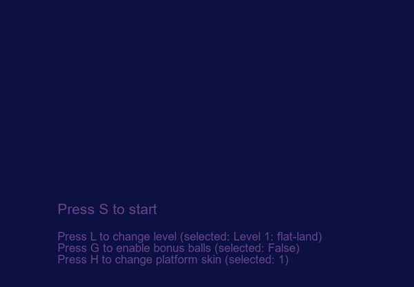
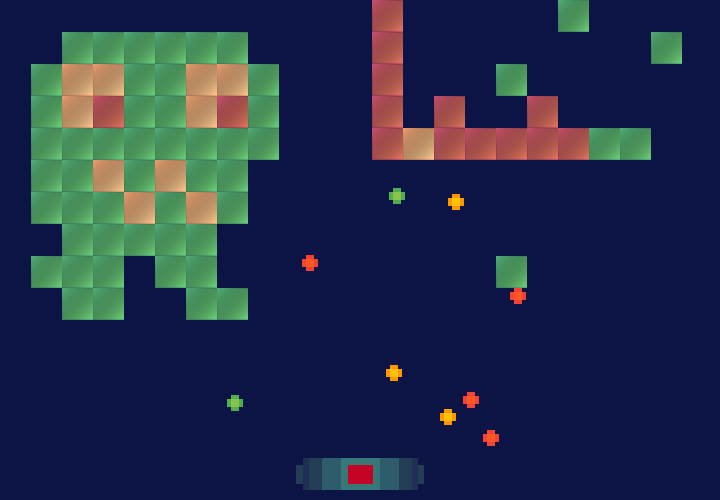
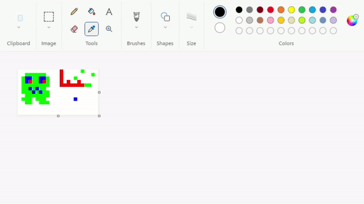
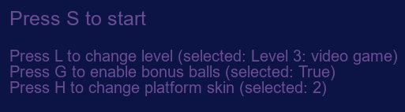

# my-arkanoid

Project is not fully uploaded here, files are only for preview, **do not copy!** Please contact me if you want to review or compile my full project.

This is my Arkanoid (Brick Breaker) implementation in Python. I used Object-Oriented Programming (OOP) paradigm in the project.

## Features of the game

- Different block lives
- Easily editable levels and skins saved in .PNG files
- Project can be easily expanded in new levels and skins
- Enjoyable pixel art style and interactive animations

 

 

## Requirements

- Windows OS
- Python 3.10 32-bit (or other version supported by pygame library)
- libraries: Pillow, pygame, numpy
